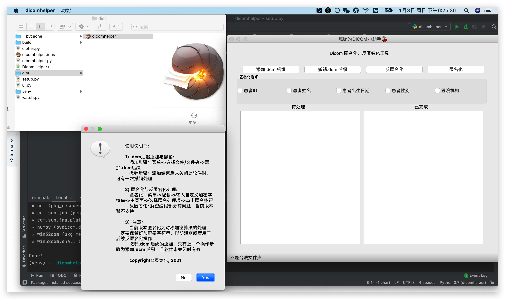

# dicomhelper
DICOM 匿名化工具 Mac版本

使用说明书:
        
        1) .dcm后缀添加与撤销:
            添加步骤：菜单->选择文件/文件夹->添加.dcm后缀
            撤销步骤：添加结束后未关闭此软件时，可有一次撤销处理
        
        2) 匿名化与反匿名化处理:
            匿名化：菜单->秘钥->输入自定义加密字符串->主页面->选择匿名处理项->点击匿名按钮
            反匿名化: 解密编码部分有问题，当前版本暂不支持
            
        3）注意：
            当前版本匿名化为对称加密算法的处理，一定要保管好加解密字符串，以防泄露或者用于后续反匿名化操作
            撤销.dcm 后缀的添加，只有上一个操作步骤为添加.dcm 后缀，且软件未关闭时有效
            
            copyright@泰戈尔, 2021